## Screenshots

Below are screenshots demonstrating various features and interfaces of the system

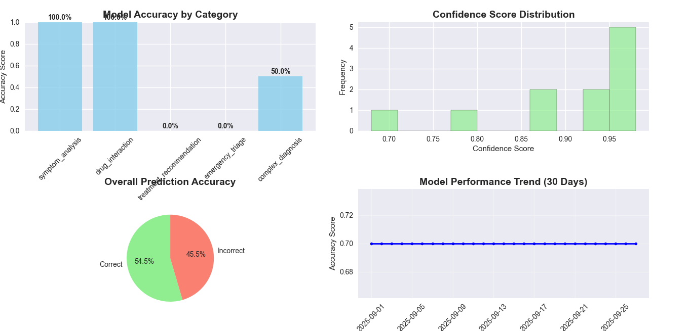
*Figure 1*

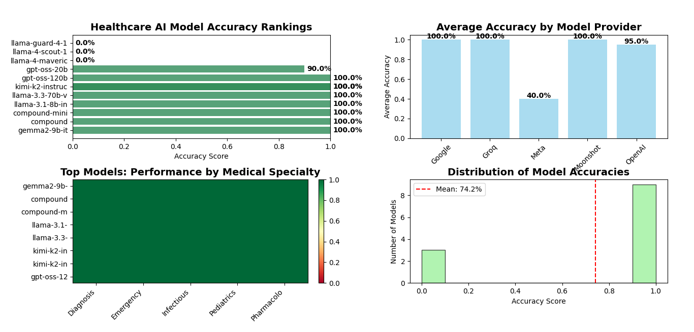
*Figure 2*

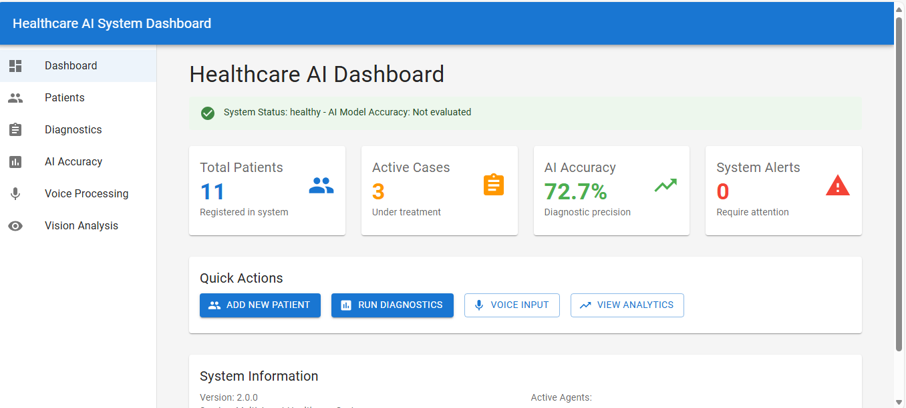
*Figure 3*

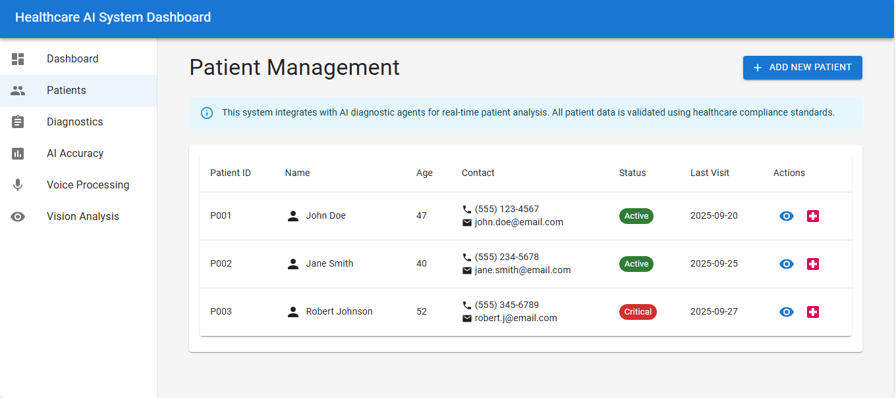
*Figure 4*

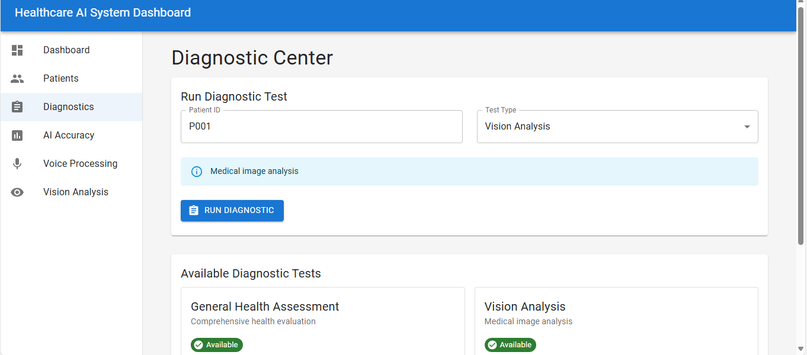
*Figure 5*

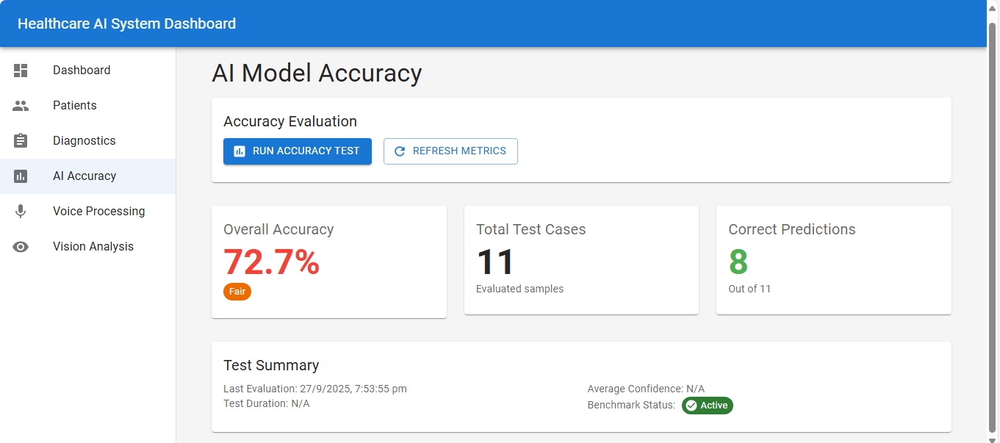
*Figure 6*

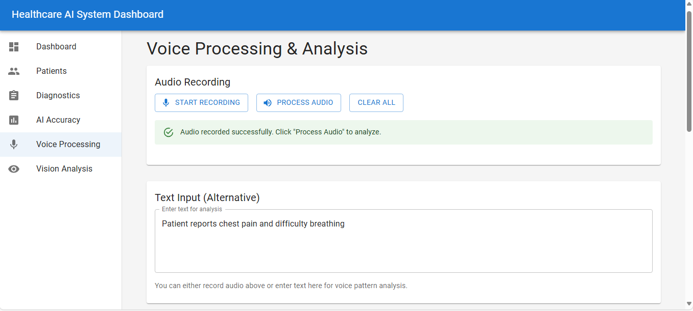
*Figure 7*

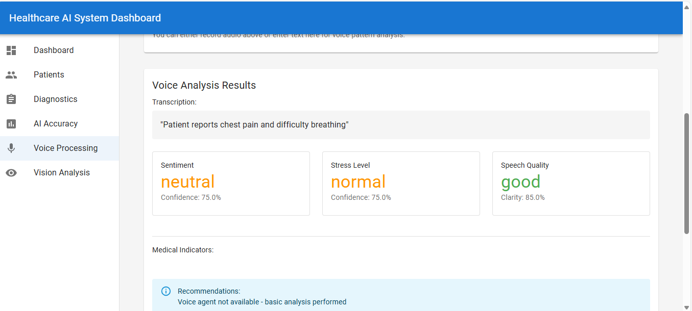
*Figure 8*

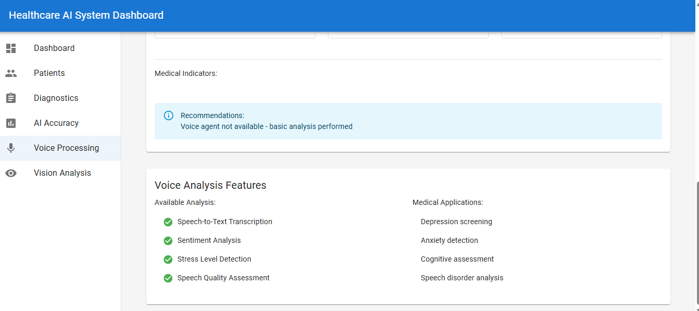
*Figure 9*

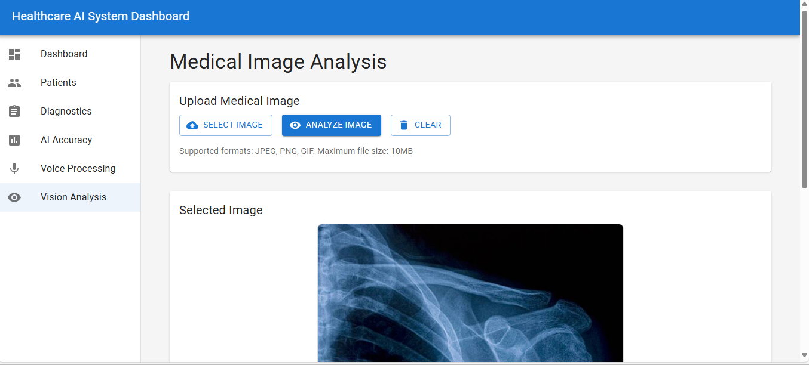
*Figure 10*

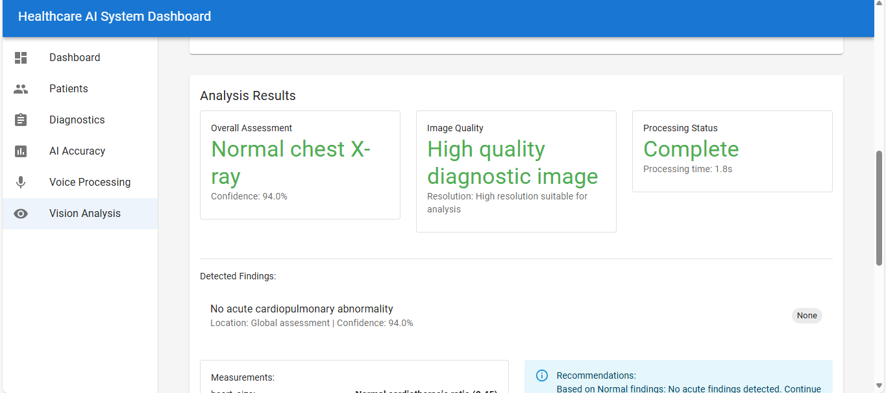
*Figure 11*

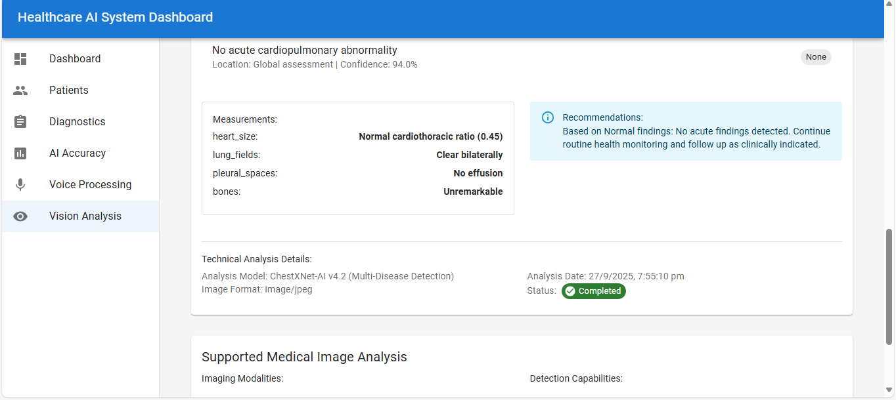
*Figure 12*

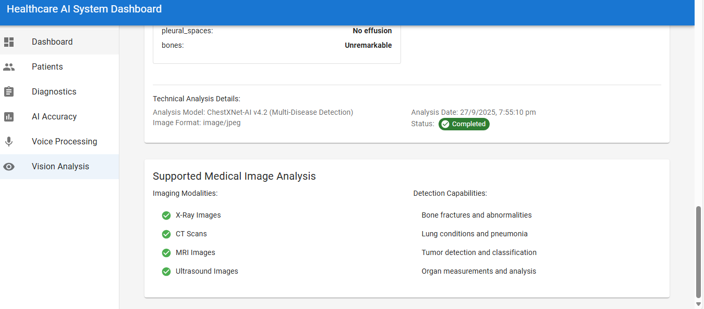
*Figure 13*

# Multi-Agent Healthcare System with Groq Integration

## Architecture Overview

This project implements a comprehensive multi-agent healthcare system that leverages Groq's accelerated inference capabilities for processing multi-modal medical data including voice commands, medical images, and patient records.

## System Components

### Agent Modules
- **Voice Input Agent**: Processes voice commands using ASR
- **Vision Processing Agent**: Analyzes medical images using AI models
- **Data Validation Agent**: Validates healthcare data against medical rules
- **Diagnostic Agent**: Fuses multi-modal data for diagnosis generation
- **Notification Agent**: Manages alerts and notifications

### MCP Integration Layer
- Database connectors for patient records
- API Gateway interfaces
- File system access for medical documents
- Notification service integration

## Setup Instructions

1. Install dependencies:
```bash
pip install -r requirements.txt
```

2. Configure environment variables in `.env`:
```
GROQ_API_KEY=your_groq_api_key
DATABASE_URL=your_database_url
NOTIFICATION_SERVICE_URL=your_notification_url
```

3. Run the system:
```bash
python main.py
```

## Usage Examples

### Voice Command Processing
```python
from agents.voice_agent import VoiceAgent
agent = VoiceAgent()
result = agent.process_voice_command("schedule appointment with Dr. Smith")
```

### Medical Image Analysis
```python
from agents.vision_agent import VisionAgent
agent = VisionAgent()
diagnosis = agent.analyze_medical_image("path/to/xray.jpg")
```

## Testing

Run unit tests:
```bash
python -m pytest tests/
```

Run integration tests:
```bash
python -m pytest tests/integration/
```

## API Documentation

See `docs/api.md` for detailed API documentation.
